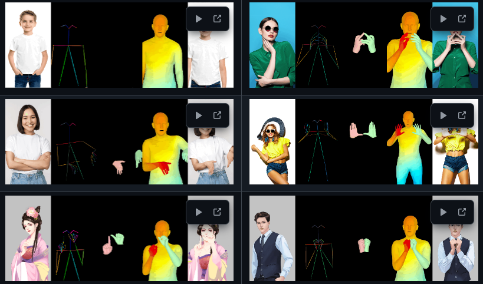
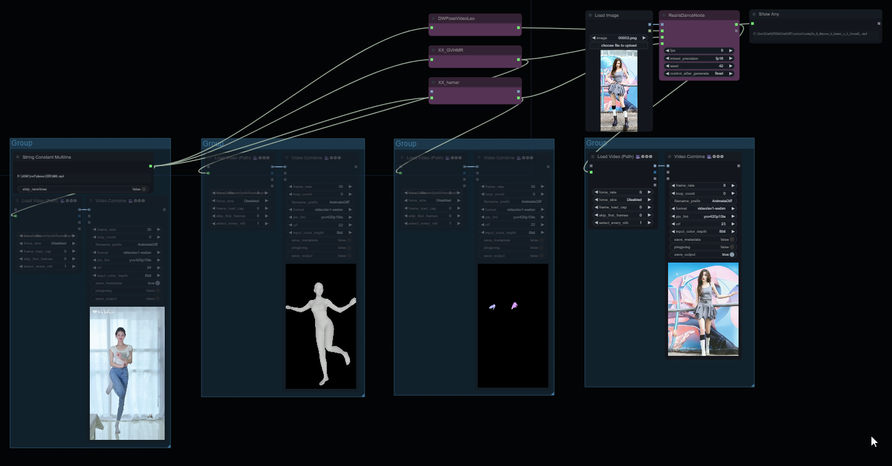
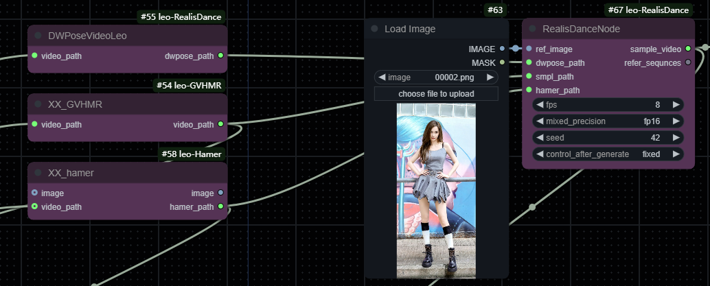

# Unoffice RealisDance-ComfyUI by leo 
base on [RealisDance](https://github.com/damo-cv/RealisDance) ,基于此项目  
modified on [RealisDanceComfyui](https://github.com/AIFSH/RealisDance-ComfyUI) ,在此项目基础上修改  
  
  
  

project consists of two nodes,  
含两个节点  

* RealisDanceNode    
The main inference node supports local file path input, you needs to input images, dwpose files, SMPL videos, and Hamer files  
主推理节点，支持本地文件输入，需输入图片，dwpose文件，smpl视频，hamer文件  
  
* DwposeVideo    
It is used for fast video dwpose inference, generating the pose file required for realisDance  
用于快速的视频dwpose推理，生成realisDance所需的pose文件  
  
* smpl文件    
generate an SMPL video using the relevant project, which can be generated my [ComfyUI-leo-GVHMR](https://github.com/leeooo001/ComfyUI-leo-GVHMR).     
可以使用相关项目生成smpl视频，可使用我的[ComfyUI-leo-GVHMR](https://github.com/leeooo001/ComfyUI-leo-GVHMR)项目生成.    
  
* hamer文件    
Hand videos can be generated using related projects, which can be generated my [ComfyUI-leo-Hamer](https://github.com/leeooo001/ComfyUI-leo-Hamer).   
可以使用相关项目生成手部视频，可使用我的[ComfyUI-leo-Hamer](https://github.com/leeooo001/ComfyUI-leo-Hamer)项目生成
  
* workflows  
The usage is simple, please refer to the workflow file  
用法简单，可参考workflows文件夹下的工作流文件  
  
## 安装    
python -m pip install -r requirements.txt    
  
Please refer to the model [RealisDance](https://github.com/damo-cv/RealisDance)    
相关模型下载，可参考官网[RealisDance](https://github.com/damo-cv/RealisDance)    
  
You can modify the relevant model path configuration in node.py file.  
node.py中可修改相关模型路径配置    

